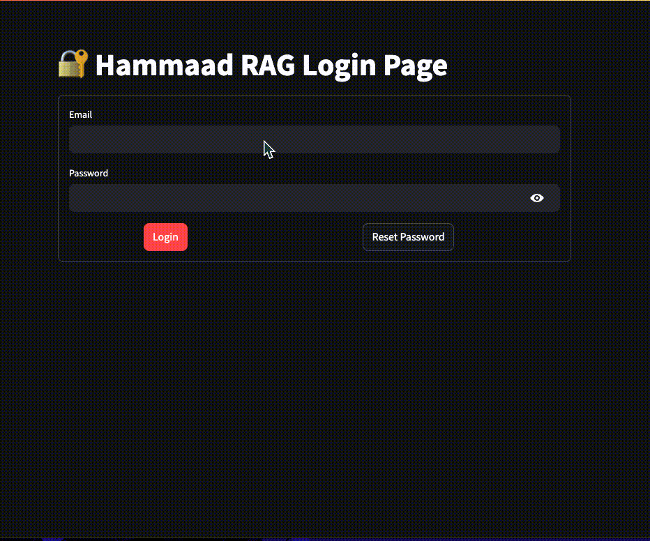

# RAG-LLD Mentor 🚀

**A Streamlit-powered RAG application for learning Low-Level Design (LLD), built with LangChain, FAISS, and OpenAI.**

---

## 📌 Index
1. [Overview](#-overview)
2. [Features](#-features)
3. [Getting Started](#-getting-started)
4. [Updating the Knowledge Base](#-updating-the-knowledge-base)
5. [Tech Stack](#-tech-stack)
6. [Future Enhancements](#-future-enhancements)
7. [License](#-license)
8. [Contributing](#-contributing)
9. [Acknowledgments](#-acknowledgments)
10. [Contact](#-contact)

---

## 📌 Overview

RAG-LLD Mentor is an AI-powered chatbot designed to assist users in learning Low-Level Design (LLD). It leverages **LangChain** for orchestration, **FAISS** for efficient similarity searching, and **OpenAI's LLM** for intelligent chat completions. The agent has been trained on knowledge bases from **Refactoring Guru** and **Educative's Grokking LLD**.

<br />
<div style="text-align: center;">
    
    <br />
    <b>AI Designs Low Level Architecture</b>
</div>
<br />

---

## ✨ Features

✅ **Retrieval-Augmented Generation (RAG)**: Enhances LLM responses with context from relevant documents.  
✅ **Streaming Responses**: Provides real-time AI-generated answers for a smoother experience.  
✅ **User Authentication**: Secure login functionality to manage user sessions.  
✅ **FAISS Vector Search**: Efficiently retrieves relevant documents for better responses.  
✅ **Custom Knowledge Base**: Easily update the document store with new learning materials.  

---

## 🚀 Getting Started

### 1️⃣ Clone the Repository
```bash
 git clone https://github.com/hammaadworks/rag-lld-mentor.git
 cd rag-lld-mentor
```

### 2️⃣ Set Up Environment Variables
Create a **.env** file and add your OpenAI API key:
```bash
 OPENAI_API_KEY=your_openai_api_key
```

### 3️⃣ Configure Authentication
Modify `constants.py` to set up your username and password:
```python
USERNAME = "your_username"
PASSWORD = "your_password"
```

### 4️⃣ Install Dependencies
```bash
 pip install -r requirements.txt
```

### 5️⃣ Run the Application
```bash
 streamlit run app.py
```

---

## 📚 Updating the Knowledge Base
To add more documents for training, edit `update_vector_db.py` and re-run it:
```bash
 python update_vector_db.py
```

This will update the FAISS vector database with new documents.

---

## 🛠️ Tech Stack
- **Streamlit** – For the frontend UI
- **LangChain** – For managing LLM interactions
- **FAISS** – For similarity search and retrieval
- **OpenAI** – For generating chat responses
- **Python** – The core programming language

---

## 🎯 Future Enhancements
🔹 Improve UI/UX with a chatbot-style interface  
🔹 Support multiple LLMs (e.g., Claude, Gemini)  
🔹 Add support for uploading custom PDFs/articles  

---

## 📜 License
This project is licensed under the MIT License.

---

## 💡 Contributing
Contributions are welcome! Feel free to open an issue or submit a pull request. 🚀

---

## 🙌 Acknowledgments
Special thanks to **Refactoring Guru** and **Educative** for providing valuable LLD resources. 🎉

---

## 📞 Contact
- **Email**: [hammaadworks@gmail.com](mailto:hammaadworks@gmail.com)  
- **GitHub**: [https://github.com/hammaadworks](https://github.com/hammaadworks)  
- **LinkedIn**: [https://www.linkedin.com/in/hammaadworks](https://www.linkedin.com/in/hammaadworks)  
- **Website**: [https://www.hammaadworks.com](https://www.hammaadworks.com)  

---

### 🌟 Star the repo if you found this useful! ⭐

